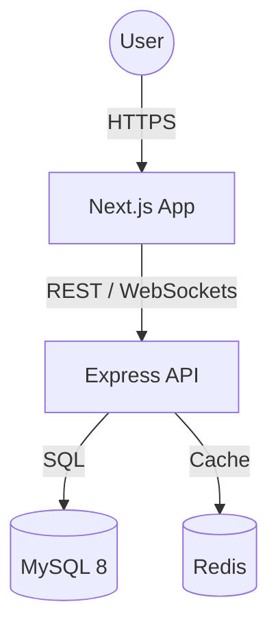

# ♻️ SwipeThrift

**SwipeThrift** is a Tinder-inspired marketplace for second-hand goods, built to solve the friction of ghosting and spam through a unique **Credit Economy**.

[](https://www.docker.com/)
[](https://nextjs.org/)
[](https://nodejs.org/)
[](LICENSE)

---

## 🌟 The Vision

Traditional marketplaces are plagued by low-intent swiping and "Is this available?" spam. SwipeThrift introduces intentionality:
- **Buyers:** Swipe Right to automatically initiate a chat.
- **Sellers:** Pay credits to list items, ensuring high-quality listings.
- **Economy:** Users earn credits through daily logins, maintaining a healthy, active ecosystem.

## 🏗 Architecture

SwipeThrift is built as a **monolithic, dockerized application** for easy deployment and development consistency.



## 🛠 Tech Stack

| Layer | Technology |
| :--- | :--- |
| **Frontend** | Next.js 14 (App Router), TypeScript, Tailwind CSS, Framer Motion |
| **Backend** | Node.js, Express, TypeScript, Knex.js |
| **Database** | MySQL 8.0 (Persistence) |
| **Caching** | Redis (Daily login cooldowns & sessions) |
| **DevOps** | Docker, Docker Compose |
| **Real-time** | Socket.io (Messaging) |

## 📁 Repository Structure

```text
swipethrift/
├── backend/            # Express API with layered architecture
├── frontend/           # Next.js 14 application
├── documentation/      # System Design (SDP) and Agent Guidelines
├── docker-compose.yml  # Full-stack orchestration
└── .gitignore          # Root-level ignore rules
```

## 🚀 Getting Started

### Prerequisites
- [Docker Desktop](https://www.docker.com/products/docker-desktop/) installed and running.

### Quick Start
1. **Clone the repository:**
   ```bash
   git clone https://github.com/yourusername/swipethrift.git
   cd swipethrift
   ```

2. **Spin up the environment:**
   ```bash
   docker-compose up --build
   ```

3. **Access the application:**
   - **Frontend:** [http://localhost:3000](http://localhost:3000)
   - **Backend Health:** [http://localhost:5000/health](http://localhost:5000/health)

## 📜 Development Guidelines

This project follows strict engineering standards for AI and human contributors:
- **[AGENTS.md](./documentation/AGENTS.md):** Mandatory coding, security, and commit standards.
- **[SDP.md](./documentation/SDP.md):** The System Design Plan and feature roadmap.
- **[GEMINI.md](./documentation/GEMINI.md):** Active implementation notes and Phase tracking.

## ⚖️ License
Distributed under the MIT License. See `LICENSE` for more information.
